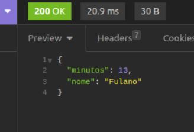

## Desafio Backend - Contador de horas trabalhadas

Essa é a minha resolução de um desafio de backend, se trata de uma API REST que calcula a duração de expediente de funcionários em uma empresa.

Desenvolvi esse código utilizando Node, Express e Sequelize

Basicamente, o usuário realiza um cadastro com seu nome e senha, após isso ele pode fazer login no sistema e apartir daí registrar o horário de início do seu expediente, terminado o seu trabalho, é possível que ele registre o horário de termino, com isso o sistema armazena esses dados e possibilita ter acesso ao horário de inicio, fim e a duração do expediente de cada funcionário. Essa API também pode ser útil pra várias outras coisas, e ocasiões que envolvam monitoramento de tempo, e pode ser vastamente explorada com vários usos.

Além disso, o sistema possui mecanismo de login e autenticação, feito com o Json Web Token, portanto apenas um usuário cadastrado poderá registrar o inicio e fim de cada expediente

Ainda pretendo continuar atribuindo algumas melhorias a essa API.

Acima está uma imagem ilustrando o que a API retorna caso o usuário deseje visualizar a duração do expediente que ele teve naquele dia de trabalho, o sistema retorna um json como resposta a requisição, informando o nome do usuário e o tempo em minutos, obtido apartir do cálculo da diferença entre o horário de inicio e fim daquele expediente.

Cada uma das funcionalidades é acessada apartir de sua própria rota (endpoint).

